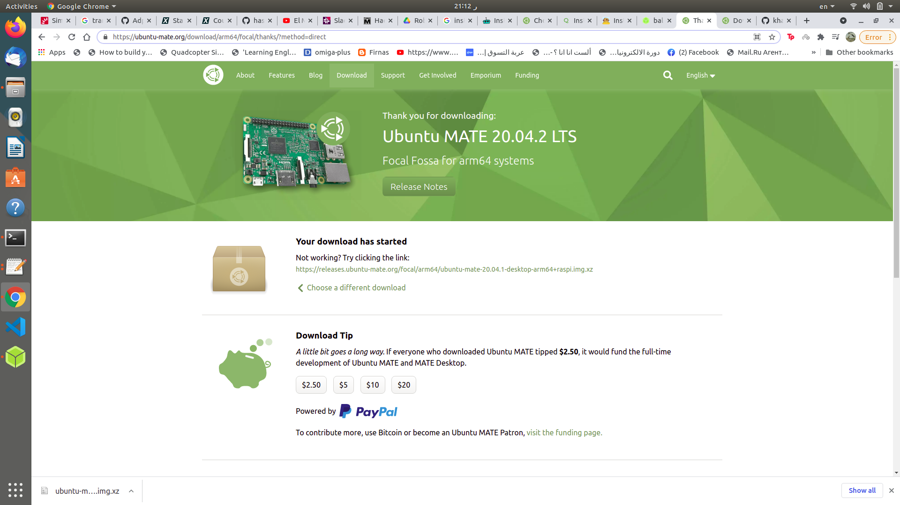
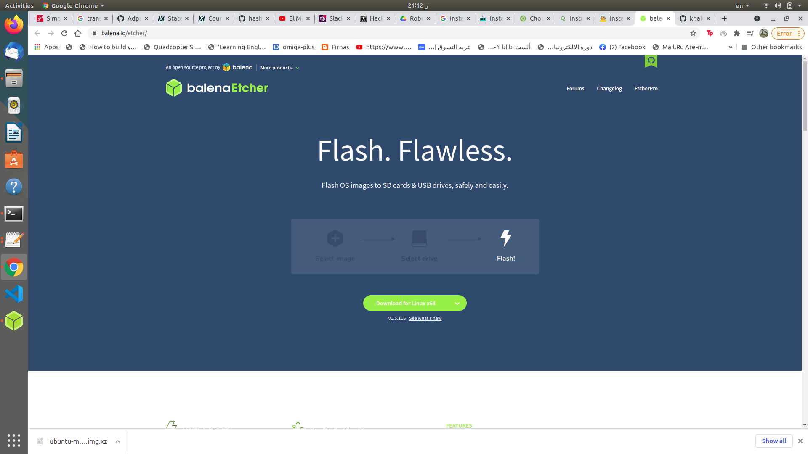

# Install Ubuntu 18.04.4 LTS on Your Raspberry Pi Board

## Step 1: Install Ubuntu Mate 20.04 LTS

<https://ubuntu-mate.org/download/arm64/focal/thanks/?method=direct>


## Step 2: Flashing Ubuntu Image on MicroSD Card

<https://www.balena.io/etcher/>



## Step 4: Install ROS Noetic on Pi4
* ### Step 1 — Set up ROS Noetic repo on Raspberry Pi 4
To install Noetic on Raspberry Pi 4, we will now add the official ROS Debian repo to the OS
```bash 
sudo sh -c 'echo "deb http://packages.ros.org/ros/ubuntu buster main" > /etc/apt/sources.list.d/ros-noetic.list'
```
* ### Step 2 — Add official ROS key
we will first add the ROS key, which is not specific to Noetic but for all ROS distros, to make sure we will install authenticated ROS packages to install on your Raspberry Pi 4 and avoid hackers to intercept your network traffic.
``` bash
sudo apt-key adv --keyserver 'hkp://keyserver.ubuntu.com:80' --recv-key C1CF6E31E6BADE8868B172B4F42ED6FBAB17C654
```

* ### Step 3 — Pull all meta info of ROS Noetic packages
Now this will be the last step before we finally install ROS Noetic package. Here you will update ROS package index to get all Noetic package information from the repo we added:
```bash 
sudo apt update
```
* ### Step 4 — Install build dependencies on Raspberry Pi 4
Now we are finally ready to install Noetic on your Raspberry Pi 4. Here what you will do is not installing the meta ROS Noetic package such as:

    ros-noetic-desktop-full
    ros-noetic-desktop
    ros-noetic-ros-base
    ros-noetic-ros-core

What you do is to build a rosinstall file and fetch these individual packages from its GitHub repository and build them.

As the heading says, we will first install all dependencies

```bash 
sudo apt-get install -y python-rosdep python-rosinstall-generator python-wstool python-rosinstall build-essential cmake
```
* ### Step 5 — Set up ROS Noetic dependency sources/repos
To install ROS Noetic desktop on your Raspberry Pi 4, we initialize rosdep so later we know where to find the Noetic dependencies.

#### rosdep init
First, we initialize rosdep, which is a ROS tool for installing dependencies:

```bash
sudo rosdep init
```
#### rosdep update
Next we run rosdep update to fetch package information from the repos that are just initialized.
```bash
rosdep update
```
If you examine the output carefully, you will see “Add distro “noetic” and “updated cache in /home/pi/.ros/rosdep/sources.cache”. If you are curious, you can take a look at the /home/pi/.ros/rosdep/sources.cache/index file and you will find the line ending with noetic. The file contains all the repos that defines the noetic distribution.

* ### Step 6 — Fetch & Install ROS Noetic dependencies
Before we begin, we will need to create a catkin workspace by:
```bash 
mkdir ~/ros_techadmics_ws
cd ~/ros_techadmics_ws
```
Then we use rosinstall_generator to generate a list of Noetic dependencies for different Noetic variants, such as desktop-full, desktop, and ros_comm.

```bash
rosinstall_generator ros_comm --rosdistro noetic --deps --wet-only --tar > noetic-ros_comm-wet.rosinstall
```
The command will run for around 5 seconds on your Raspberry Pi, and there is no output when it is done.

Next we will use the wstool to fetch all the remote repos specified from the noetic-ros_comm-wet.rosinstall file locally to the src folder:
```bash
wstool init src noetic-ros_comm-wet.rosinstall
```
It will take a few minutes and will output update complete when done.

Then before compiling the packages in the src folder, we install all system dependencies using rosdep install:
```bash 
rosdep install -y --from-paths src --ignore-src --rosdistro noetic -r --os=debian:buster
```
* ### Step 7 — Compiling Noetic packages on Raspberry Pi 4
Before we continue, it is recommenced to increase the swap space, which is used when the physical memory space on your Raspberry Pi is used up.

First we turn off swap:
```bash
sudo dphys-swapfile swapoff
```
Then we edit the following file to increase the swap space form 100 MB to 1024 MB (1 GB). As you may notice as well, 100 MB is quite small.
```bash
sudoedit /etc/dphys-swapfile
```
Then we call dphys-swapfile to set up the swap:
```bash
sudo dphys-swapfile setup
```
Finally we turn the swap back on:
```bash
sudo dphys-swapfile swapon
```
let's complete step 7 compiling Noetic pkgs
```bash
sudo src/catkin/bin/catkin_make_isolated --install -DCMAKE_BUILD_TYPE=Release --install-space /opt/ros/noetic -j1 -DPYTHON_EXECUTABLE=/usr/bin/python3
```
Here we pass 4 additional arguments.
1.    ```bash -DCMAKE_BUILD_TYPE=Release ```
